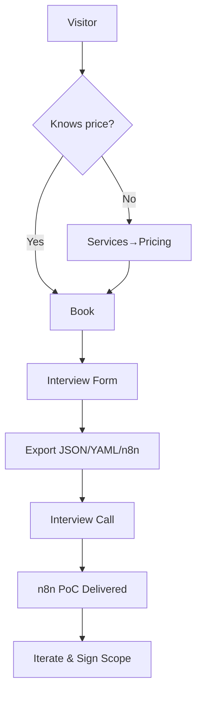

# FlowXray — Product Requirements Document (PRD)

## 1) Overview

**Product:** FlowXray — website + toolkit to capture how work actually happens, then auto‑generate **n8n agentic workflows** and a role **copilot PoC**. The site promotes a freelance service and embeds the structured interview form (with AI follow‑ups and n8n‑JSON export).

**Primary outcome:** lead conversion → interview → export (JSON/MD/YAML/**n8n JSON**) → PoC delivery → upsell to full implementation.

---

## 2) Value Proposition & Audience

- **SMBs & departments** (IT, Support, Sales, Accounting, Dev, Eng, PM, Research, HR, Legal, Finance, Ops).
- **Benefits:** faster discovery; standardized specs; immediate PoC; lower risk via incremental automation.

**Top jobs‑to‑be‑done:**

1. Understand current processes and weak spots.
2. Get a tangible PoC quickly (n8n + copilot prompt pack).
3. Decide next steps with clear ROI.

---

## 3) User Stories

| ID    | As a …             | I want …                            | So that …                            |
| ----- | ------------------ | ----------------------------------- | ------------------------------------ |
| US‑01 | Decision maker     | a clear value proposition & pricing | I can book an interview              |
| US‑02 | Team lead          | an embedded form with AI follow‑ups | specs are complete the first time    |
| US‑03 | Analyst            | export to n8n JSON + YAML           | I can import to n8n without handwork |
| US‑04 | Security officer   | clear GDPR & data‑flow              | we can approve the engagement        |
| US‑05 | Founder/Freelancer | case studies                        | prove credibility                    |

table-id: user-stories

---

## 4) Information Architecture (IA)

| Route              | Purpose          | Key modules                              |
| ------------------ | ---------------- | ---------------------------------------- |
| `/` Home           | Value prop + CTA | Hero, 3‑step, trust, CTA                 |
| `/services`        | What’s included  | Interview → Spec → n8n PoC, deliverables |
| `/pricing`         | Tiers            | Per‑role + add‑ons                       |
| `/cases`           | Case studies     | Cards + detail pages                     |
| `/book`            | Booking          | Cal.com embed + fallback                 |
| `/form`            | Interview app    | Embedded form + export to n8n            |
| `/about`           | Bio/approach     | Ethics, tools                            |
| `/legal/impressum` | DE imprint       | Company info                             |
| `/legal/privacy`   | GDPR             | Data‑flow & retention                    |
| `/blog` (opt)      | SEO              | Articles                                 |
| `/thanks`          | Conversion       | Next steps                               |

table-id: ia-routes

---

## 5) Key Journeys



genid: flowxray-funnel-01

```mermaid
flowchart LR
  X[Interview Form] -->|JSON| S[Spec]
  S -->|Generator| N[n8n Workflow JSON]
  N -->|Import| W[n8n]
  S -->|Prompt Kit| C[Role Copilot (LLM)]
```

genid: flowxray-arch-01

---

## 6) Functional Requirements

1. **Static‑first site** (HTML + Tailwind CDN + small JS). Optional serverless (email relay/file upload) on Netlify/Vercel.
2. **Embedded Interview Form** at `/form` with:
   - AI follow‑ups via OpenRouter (`openrouter/auto`).
   - Export: JSON, Markdown, YAML, **n8n workflow JSON**.
   - Upload artifacts (templates, PDFs, CSV, code snippets) — local‑first; optional encrypted temp upload.
3. **Booking** on `/book` via Cal.com/Calendly + email fallback.
4. **Cases** and **Pricing** driven by JSON data files.
5. **i18n**: DE (default), EN, RU; toggle persisted to `localStorage`.
6. **Analytics**: Plausible/Umami (EU, cookieless). No Google Analytics by default.
7. **SEO**: meta, OG/Twitter tags, sitemap, robots.
8. **Legal**: Impressum, Privacy (GDPR), cookie‑free by design; consent copy for the form.

---

## 7) Interview Form Integration (Scope for /form)

- Modules: metadata/consents, systems/channels, inputs/outputs, processes (steps/decisions/exceptions/SLA), comms policies (cadence, retries, quiet hours, escalation), volumes & seasonality, RACI, rules/risks, KPI, security, day‑in‑life, recent cases, automation ideas & priorities, artifact uploads.
- **Browser/Computer use hints** (URL, selectors, navigation steps, timing waits).
- **AI follow‑ups**: max 5 dynamic questions per section; request artifacts; fill missing conditions for n8n nodes.
- **n8n export**: generate importable JSON; credentials as placeholders; Wait/If/Loop mapping; error handler stub.

---

## 8) n8n Export Generator (Rules)

| Input node        | n8n node                  | Mapping rule                   |
| ----------------- | ------------------------- | ------------------------------ |
| email trigger     | IMAP/Email Trigger        | filters by subject/sender      |
| chat trigger      | Slack/Teams Trigger       | channel/thread id              |
| time trigger      | Cron                      | cron expr from SLA windows     |
| step: API         | HTTP Request              | method/url/auth from `systems` |
| step: web UI      | Browser                   | sequence of selectors/actions  |
| decision          | IF/Switch                 | conditions from `decisions[]`  |
| follow‑up cadence | Wait + Loop               | delays + max retries           |
| escalation        | Notify node               | channel/person from RACI       |
| output            | SMTP/Drive/SharePoint/CRM | storage/delivery mapping       |

table-id: n8n-mapping-rules

---

## 9) Data Model (Export)

| Node            | Required fields                                                                            |
| --------------- | ------------------------------------------------------------------------------------------ |
| meta            | company, dept, role, interviewer, date, consents                                           |
| systems         | name, type, owner, access, api\_available, rate\_limits                                    |
| inputs          | name, source\_system, format, frequency, avg/peak volume, expected SLA                     |
| outputs         | name, consumer, template\_ref, storage, due, quality checks                                |
| processes       | name, trigger, steps[], decisions[], exceptions, sla, ui\_hints[]                          |
| comms\_policies | channel, inbound\_sla, followup\_cadence, max\_retries, escalation\_path, quiet\_hours, tz |
| raci            | party, interaction, role (R/A/C/I), channel                                                |
| time\_audit     | task, freq, mins, automatable%                                                             |
| artifacts       | type(email/excel/pdf/code/cad), fileRef/URL, description                                   |

table-id: export-data-schema

---

## 10) Pricing & Packages (Content Spec)

| Tier      | What’s included                                   | Indicative price    |
| --------- | ------------------------------------------------- | ------------------- |
| Role Spec | Interview + structured spec + exports             | €500–€1500 per role |
| PoC       | n8n workflow import + tweaks + copilot prompt kit | €1k–€3k             |
| Training  | 2h handover + docs                                | €300/session        |

table-id: pricing-spec

---

## 11) Integrations & Keys

| Area        | Option                         | Notes                           |
| ----------- | ------------------------------ | ------------------------------- |
| Booking     | Cal.com                        | iframe + link                   |
| Email relay | SMTP/Formspree/Netlify Fn      | GDPR notice                     |
| AI          | OpenRouter (`openrouter/auto`) | follow‑ups in form              |
| Analytics   | Plausible/Umami                | cookieless                      |
| Storage     | Drive/SharePoint (optional)    | artifacts if serverless enabled |

table-id: integrations

---

## 12) Non‑Functional Requirements

- **Performance:** LCP < 2.5s mobile; total JS < 80KB gz.
- **Accessibility:** WCAG 2.1 AA basics; keyboard nav; visible focus.
- **Security:** no PII stored server‑side by default; optional encrypted upload with TTL.
- **Reliability:** graceful offline for static pages; form warns before unload.

---

## 13) Security & Privacy (GDPR)

| Item         | Requirement                                     |
| ------------ | ----------------------------------------------- |
| Consents     | explicit checkboxes (recording, PII processing) |
| Minimization | collect only needed fields; masking on export   |
| Retention    | by contract; default local storage only         |
| DPA          | if serverless used, list processors             |
| Data flow    | textual diagram on Privacy page                 |

table-id: gdpr-items

---

## 14) Analytics & SEO

- Pages tracked with Plausible events: `view_home`, `click_book`, `open_form`, `export_n8n`.
- Sitemap, robots, canonical, OpenGraph, Twitter cards; JSON‑LD for business.

---

## 15) Branding & Copy

- Tone: clear, practical, low‑buzzwords.
- Tagline: **“X‑ray your ops. Ship automation.”**
- Buttons: **Book a call**, **Try the form**, **See PoC sample**.

---

## 16) Localization (i18n)

- Language toggle (DE default; EN, RU) stored in `localStorage`.
- Content keys in `/i18n/{de,en,ru}.json`.

---

## 17) Tech Stack

- HTML, Tailwind CDN, Alpine.js (optional), vanilla JS; no build required.
- Optional serverless (Netlify/Vercel) for email/upload.

---

## 18) Repository Structure

```
/ (root)
  index.html
  services.html
  pricing.html
  cases.html
  book.html
  about.html
  legal/impressum.html
  legal/privacy.html
  form/index.html      # embedded interview app
  assets/{img,svg}
  js/{i18n.js,nav.js,analytics.js}
  data/{pricing.json,cases.json,faq.json}
  i18n/{de.json,en.json,ru.json}
```

---

## 19) Implementation Slices (for AI Code Agents)

| Slice         | Scope                                | Acceptance                    |
| ------------- | ------------------------------------ | ----------------------------- |
| S1 Skeleton   | layout, Tailwind, nav/footer, routes | valid HTML; mobile nav works  |
| S2 Home       | hero, 3‑step, CTA, trust             | lighthouse ≥90 mobile         |
| S3 Services   | cards, deliverables                  | links working                 |
| S4 Pricing    | JSON‑driven table                    | toggle currency EU/DE         |
| S5 Cases      | list + template                      | loads from `/data/cases.json` |
| S6 Booking    | Cal.com embed + fallback             | success page `/thanks`        |
| S7 Form Embed | iframe/direct include + guide        | export buttons visible        |
| S8 Legal      | impressum/privacy                    | GDPR items present            |
| S9 i18n       | toggle DE/EN/RU                      | persists across pages         |
| S10 Analytics | Plausible                            | events fire                   |

table-id: impl-slices

---

## 20) Acceptance Criteria & QA

- All routes reachable from nav; active state shows.
- Form exports JSON/MD/YAML/**n8n JSON**; files download OK.
- Booking works in DE time zone; confirmation email copy present.
- No PII leaves browser unless explicit upload is used.
- Lighthouse scores: Perf/SEO/A11y/Best‑Practices ≥ 90.

---

## 21) Roadmap (Post‑MVP)

- Generate BPMN/DFD from export.
- One‑click **n8n import** link with pre‑filled credentials map.
- Case study generator from finished PoCs.
- PWA + offline reading mode.

---

## 22) Risks & Mitigations

| Risk                        | Mitigation                             |
| --------------------------- | -------------------------------------- |
| Incomplete specs from users | AI follow‑ups, artifact requirement    |
| n8n import mismatches       | strict node templates + mapping table  |
| GDPR concerns               | local‑first; optional encrypted upload |
| Vendor lock‑in fears        | export to generic YAML + docs          |

table-id: risks

