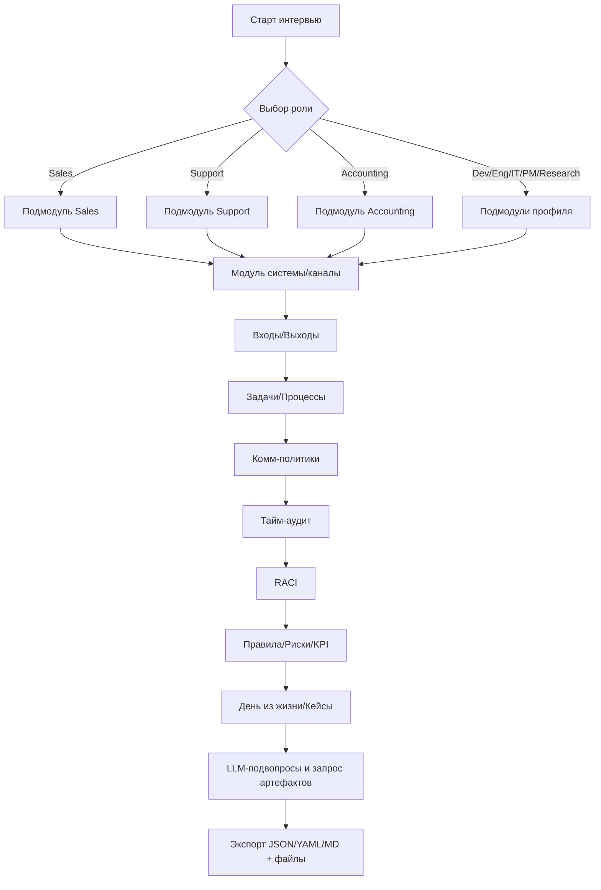

# PRD — Универсальный опросник для автоматизации ролей (Agentic Workflow + Copilot)

## 1) Цель и результат
**Цель:** собрать структурированные данные о реальной работе сотрудника (входы, выходы, шаги, правила, риски, метрики, объёмы) так, чтобы на их основе можно было:
- (Этап 2) собрать визуальный **agentic workflow** в n8n/Make и/или оркестраторах с поддержкой **browser/computer use**;
- спроектировать **LLM‑копилота** (e‑mail/чат/код/документы/CAD/CRM) для частичной/полной автоматизации.

**Результат опроса (экспорт):** JSON + YAML‑спецификация процесса, Markdown‑отчёт, опционально CSV/DOCX, вложения (артефакты, шаблоны, примеры писем/таблиц/кода).

---

## 2) Персоны и охват ролей
Ниже — роли, их типовые активности, артефакты и системы. Этот каталог расширен, чтобы покрыть максимум офисных функций; он управляет динамическими ветвлениями опроса и пресетами вопросов.

| Роль | Типовые активности | Артефакты | Системы/Каналы |
|---|---|---|---|
| Sales (B2B/B2C/Inside) | лидогенерация, квалификация, демо, офферы, фоллоу‑апы | e‑mail, КП/оффер, договор, CRM‑сделки | CRM, e‑mail, телефония, Zoom/Meet, календари |
| Customer Success / Account Mgmt | онбординг, QBR, продление, апселл | планы успеха, заметки, отчёты | CRM/CS‑платф., e‑mail, чат |
| Support/Helpdesk | triage, эскалации, базы знаний, SLA | тикеты, макросы, отчёты | Jira/ServiceNow, e‑mail, чат, телефон |
| Marketing (Content/SEO/Perf/SMM) | контент‑план, кампании, лид‑магниты | посты, лендинги, креативы, отчёты | CMS, Ads, соцсети, аналитика |
| Community/PR/Comms | анонсы, ответы, медиапланы | пресс‑релизы, посты | соцсети, почта, медиа‑CRM |
| HR/Recruiting | вакансии, сорсинг, интервью, офферы | JD, резюме, оценочные формы | ATS, LinkedIn, e‑mail, календарь |
| L&D/Training | программы, курсы, обуч.материалы | планы, записи, квизы | LMS, видео, почта |
| Legal/Compliance | договоры, согласования, проверки | контракты, шаблоны, реестры | DMS/CLM, e‑mail, э‑подпись |
| Finance (AR/AP/Treasury/Tax) | счета/акты, платежи, сверки, отчётность | счета, выписки, декларации | ERP/1С, банк‑клиент, e‑mail |
| Payroll | ведомости, начисления, отчёты | Excel/PDF, выгрузки | HRIS/ERP, банк |
| Procurement/Vendor Mgmt | заявки, RFQ/RFP, заказы | контракты, POs, прайс‑листы | ERP, e‑mail, порталы |
| Product Mgmt | бэклог, роадмэп, исследования | спецификации, PRD, метрики | Issue‑трекер, аналитика, календарь |
| UX Research/Design | исследования, тесты, макеты | прототипы, отчёты | Figma, опросники, видео |
| Development (SW) | код/ревью, CI/CD, релизы | PR, issues, релиз‑ноты | Git, CI, issue‑трекер, Slack |
| QA (SW/Lab) | планы тестов, отчёты, баги | тест‑кейсы, отчёты | TestRails/Jira, CI |
| IT Ops/SRE | инциденты, деплой, мониторинг | RFC, инцидент‑карты | CMDB, Grafana, PagerDuty |
| Security/GRC | политики, аудиты, инциденты | отчёты, реестры, исключения | GRC‑системы, SIEM |
| Data/BI/Analytics | сбор/ETL, отчёты, дашборды | SQL/ноутбуки, графики | DWH, BI, Jupyter |
| Engineering (HW/CAD/PLM) | ревизии, BOM, ECR/ECO | CAD, PDF, спецификации | CAD/PLM/PDM, e‑mail |
| Facilities/Office Mgmt | заявки, сервис, инвентарь | заявки, акты | Helpdesk/CMMS |
| Reception/Event | приём звонков, встречи, события | календари, списки гостей | календарь, телефония |
| Logistics/Warehouse | приём/отгрузка, запасы | накладные, инвентарь | WMS/ERP |
| EHS/Quality (ISO) | инциденты, CAPA, проверки | отчёты, чек‑листы | QMS, формы |
| Localization | задачи перевода, глоссарии | TMX/XLIFF, гайды | TMS, CAT |
| Technical Writing | мануалы, релиз‑ноты | docs, PDF | DMS, Git |
| Research (Sci/Market) | обзоры, эксперименты | отчёты, публикации | базы, ноубуки |

table-id: roles-coverage

---

## 3) Таксономия вопросов (ядро формы)
Форма построена модульно. Каждый модуль может включаться/исключаться и содержит обязательные поля для agentic‑схемы.

1. **Метаданные и согласия**: компания, роль, команда, дата, интервьюер, PII/GDPR согласия, уровень конфиденциальности.
2. **Системы и каналы**: перечень источников/приёмников (e‑mail, CRM, телефония, чат, ERP, CAD, Git, API, Drive/SharePoint, мессенджеры). Для каждого: owner, доступы, лимиты, API‑возможности.
3. **Входы**: «что приходит» (тип, формат, частота, объём/день, SLA ожидания от входа, откуда, авторизация/роли).
4. **Выходы**: «что производит» (тип артефакта, потребитель, шаблон/стандарт, место хранения, срок отправки, требования к качеству/валидации).
5. **Задачи/процессы**:
   - **Триггер** (входящее письмо/тикет/сигнал системы/время);
   - **Шаги** (пошагово, инструменты, поля/селекторы если web‑UI, горячие клавиши);
   - **Развилки/решения** (условия, бизнес‑правила, формулы);
   - **Исключения/ошибки** (ручные обходы, эскалации);
   - **SLA/дедлайны**.
6. **Политика коммуникаций** (для каждого канала):
   - ожидания и **частота фоллоу‑апов** (через сколько часов/дней повторять запрос);
   - **макс. число повторов**; **тон/шаблон** фоллоу‑апа; **канал смены** (если нет ответа — звонок);
   - **временные окна** (когда не беспокоить), time‑zone контрагентов.
7. **Объёмы и ритмы**: средние/пики **письма/звонки/тикеты/PR/счета** в день/неделю; длительность типовых действий; сезонность.
8. **RACI и взаимодействия**: кто R/A/C/I по задачам, через какие каналы, с какими SLA.
9. **Бизнес‑правила и соответствие**: политики, формулы, допустимые источники, секретность, ретенция, шифрование, аудиты.
10. **Риски/ошибки/комплаенс**: типовые сбои, штрафы за SLA, требования (GDPR, ISO, SOX и пр.).
11. **Метрики/KPI**: целевые/текущие, как измеряются, где смотреть (дашборды), период отчётности.
12. **День из жизни** (таймлайн) и **последние 5 кейсов** (скрытые данные PII редактируются).
13. **Идеи автоматизации и приоритеты** (ожидаемый эффект, сложность, зависимости).
14. **Артефакты‑примеры (загрузка)**: шаблоны писем, Excel, PDF, договоры, скринкасты действий, фрагменты кода/SQL, CAD.

---

## 4) Политики каналов (собираемые поля)
| Канал | SLA входа | Каденс фоллоу‑апа | Макс. ретраев | Эскалация | Временные окна | Замечания |
|---|---|---|---|---|---|---|
| E‑mail | 4ч в рабочее время | 24ч, затем 72ч | 3 | звонок/менеджер | 9:00–18:00 | использовать шаблон «FYI/Reminder» |
| Телефон | 2ч | каждые 2ч в рабочее | 2 | мессенджер | 10:00–17:00 | не звонить вне окон |
| Чат (Slack/Teams) | 1ч | 4ч | 4 | e‑mail | 9:00–18:00 | тред, не в личку |
| CRM‑таск | по договору | дневной | 3 | PM | спринт‑слоты | SLA как в проекте |

table-id: channel-policies

---

## 5) Метрики объёмов/времени (обязательно для ROI)
| Метрика | Определение | Единицы | Как собирается |
|---|---|---|---|
| e‑mail вход | писем/день | шт | опрос + выборка inbox |
| звонки исходящие | звонков/день | шт | телефония/опрос |
| средняя длительность шага | мин/задача | мин | замер/опрос |
| автоматизируемость | % шага | % | экспертная оценка |

table-id: volume-metrics

---

## 6) Динамическая логика (LLM‑подвопросы)
**Движок подвопросов:** при заполнении модулей ответы отправляются в LLM через OpenRouter (default: `openrouter/auto`). Модель предлагает уточняющие подвопросы и заранее раскладывает процесс на шаги/условия/исключения, а также просит **артефакты‑примеры**.

**Пример системного промпта для генерации подвопросов:**
```
Ты — аналитик процессов. На входе: роль, список систем, входов, выходов и описания задач.
Цель: собрать недостающие детали для агентного автоматизатора (n8n/Make) и LLM‑копилота.
Сгенерируй до 5 уточняющих вопросов:
- о шагах (что кликаем/вводим/копируем, поля/селекторы, горячие клавиши)
- о правилах (формулы, пороги, если‑то)
- о коммуникациях (SLA, фоллоу‑апы, эскалации)
- о данных (форматы, шаблоны, приватность)
- об объёмах (день/неделя, пики)
Требуй артефакты‑примеры. Учитывай канал и роль.
```

**API:** прямая интеграция с OpenRouter (поля: модель, ключ, системный промпт, лимиты токенов, температура, retry‑политика).

---

## 7) Модули под роли (предустановки вопросов)
### 7.1 Sales
- Фанел: лид → контакт → встреча → оффер → сделка → пост‑sale.
- KPI: скорость ответа, конверсия, средний чек, активность, win‑rate.
- Артефакты: письма, КП, договор, CRM поля. Требовать шаблоны.
- Комм‑политики: фоллоу‑ап‑каденс, смена канала при молчании, календарные слоты.

### 7.2 Support/Helpdesk
- Triage, приоритезация, макросы, базы знаний, эскалации, SLA на ответ/резолв.
- Инциденты vs сервис‑запросы; стандартные обходы.
- Метрики: FRT, MTTR, reopen‑rate.

### 7.3 Accounting
- Пайплайн: входящий счёт → проверка → проведение → платеж → сверка → отчётность.
- Нормы: реквизиты, налоги, ретенция документов.
- Артефакты: счета, акты, банкинг, выгрузки Excel/PDF.

### 7.4 Development (SW)
- Процессы: план → код → ревью → тест → релиз → мониторинг.
- Артефакты: PR, issue, build‑статусы, релиз‑ноуты.
- Метрики: cycle time, lead time, review latency.

### 7.5 Engineering (HW/CAD)
- Ревизии, согласования, BOM, выдача производству, контроль изменений (ECO/ECR).
- Артефакты: CAD‑файлы, чертежи, PDF, спецификации, BOM.

### 7.6 IT Ops
- Инциденты, изменения, деплоии, алерты, on‑call, окна изменений.
- Инструменты: monitoring, CMDB, runbooks (просить!).

### 7.7 Management/PM
- OKR, риск‑реестр, 1:1, артефакты стейкхолдеров, комитеты.

### 7.8 Research/Analytics
- Пайплайн: постановка вопроса → сбор данных → анализ → визуализация → отчёт.
- Репликабельность, источники, лицензии, хранение данных.

---

## 8) Структурные элементы для **computer/browser use**
Собирать дополнительно (если действие в UI веб‑приложений):
- URL/раздел; шаги навигации; названия кнопок/вкладок; поля ввода и подписи;
- опционально CSS‑селекторы/XPath/ARIA‑лейблы; горячие клавиши;
- требования к времени ожидания (loading spinners);
- чувствительные данные (маскирование при записи демо‑видео);
- загрузка **скринкаста**/скриншотов шага (опционально).

---

## 9) Карта данных (экспортная схема)
Топ‑уровень: `meta`, `systems`, `inputs`, `outputs`, `processes`, `comms_policies`, `raci`, `time_audit`, `rules`, `risks`, `kpi`, `security`, `day`, `cases`, `automation`, `priorities`, `artifacts`.

| Узел | Поля (минимум) |
|---|---|
| meta | company, dept, role, interviewer, date, consent_record, consent_pii, confidentiality |
| systems | name, type, owner, access, api_available, rate_limits |
| inputs | name, source_system, format, frequency, avg_volume, peak_volume, sla_expected |
| outputs | name, consumer, template_ref, storage, due, quality_checks |
| processes | name, trigger, steps[], decisions[], exceptions, sla, ui_hints[] |
| comms_policies | channel, inbound_sla, followup_cadence, max_retries, escalation_path, quiet_hours, tz |
| raci | party, interaction, role(R/A/C/I), channel |
| time_audit | task, freq, mins, automatable% |
| artifacts | type(email/excel/pdf/code/cad/etc), fileRef, description |

table-id: data-schema-top

---

## 10) Оценка готовности к автоматизации (скoring)
| Компонент | Вес | Правило |
|---|---:|---|
| Объём повторяющихся шагов | 0.3 | >30% времени на рутину ↑ |
| Формализованность правил | 0.25 | формулы/шаблоны/если‑то ↑ |
| Доступность API/интеграций | 0.2 | открытые API/webhooks ↑ |
| SLA и коммуникации | 0.15 | чёткие каденции/окна ↑ |
| Риски и комплаенс | 0.1 | низкая чувствительность ↑ |

`score = Σ(weight_i * normalized_i)`

table-id: readiness-scoring

---

## 11) Соответствие и безопасность (GDPR‑чеклист)
| Пункт | Да/Нет | Комментарий |
|---|---|---|
| Согласия получены (запись, PII) |  |  |
| Минимизация данных |  |  |
| Редакция PII при экспорте |  |  |
| Ретенция/удаление |  |  |
| Шифрование хранения |  |  |
| Доступы по ролям |  |  |

table-id: gdpr-checklist

---

## 12) UX/Flow интервью


genid: prd-ux-arch-01

---

## 13) Интеграции и маппинг к n8n/Make
| Поле опроса | Узел/Концепт n8n | Пример |
|---|---|---|
| inputs.source_system=email | IMAP/Email Trigger + SMTP | «Новый входящий с темой X → Ответить/форвард» |
| inputs.source_system=slack/teams | Slack/Teams Trigger | «Новый тред → создать тикет» |
| inputs.source_system=crm | HTTP/CRM node | «GET /api/leads?id={{leadId}}» |
| processes.steps[] (web‑UI) | Browser Automation / HTTP | «Открыть URL, клик по селектору, заполнить форму» |
| comms_policies | Wait/If/Loop + канал | «Ждать 24ч → если нет ответа → повтор/смена канала» |
| artifacts | Binary data / Drive/SharePoint | «Сохранить вложение, дать ссылку» |
| raci | Notify/Assign | «Уведомить A при исключении; Assign ticket» |
| finance/erp | HTTP/SOAP/1C/ERP | «POST документ в ERP» |
| telephony | Twilio/Asterisk | «Сделать звонок/отправить SMS» |
| calendars | Google/Microsoft Calendar | «Создать встречу/слот» |
| spreadsheets | Google Sheets/Excel 365 | «Append row / read range» |
| docs | Notion/Confluence | «Создать страницу отчёта» |
| issues | Jira/GitHub/GitLab | «Создать issue/PR/transition» |

table-id: n8n-mapping

---

## 14) Нефункциональные требования
- **Локхранилище черновиков**, импорт/экспорт без сервера; опционально — backend для файлов >10MB.
- **PII‑редакция** по чекбоксу; шифрование при сохранении (опционально: пароль проекта).
- **Аудит**: версия опроса, кто/когда редактировал.
- **Доступность**: mobile‑friendly, клавиатурная навигация.
- **Расширяемость**: добавление новых модулей ролей без изменения ядра.

---

## 15) Фичи MVP
1. Модульная форма (из 3 раздела) + предустановки ролей (7 раздел).
2. Движок LLM‑подвопросов (6 раздел) с OpenRouter.
3. Загрузка артефактов (14 раздел) и ссылки на системы.
4. Экспорт JSON/YAML/MD + архив с вложениями.
5. Подсчёт readiness‑score (10 раздел) и сводка ROI (экономия минут/неделя).

---

## 16) Пример JSON‑фрагмента экспорта
```json
{
  "meta": {"company":"Acme","role":"Account Manager","date":"2025-08-25"},
  "comms_policies": [
    {"channel":"email","inbound_sla":"4h","followup_cadence":"24h, 72h","max_retries":3,
     "escalation_path":"call → manager","quiet_hours":"18:00-09:00","tz":"Europe/Berlin"}
  ],
  "processes": [
    {"name":"Ответ на входящий e‑mail","trigger":"новое письмо",
     "steps":["Открыть CRM","Найти клиента","Ответить по шаблону A"],
     "decisions":["Есть номер договора?","Есть просроченный счёт?"],
     "exceptions":"ручной эскалейшн в PM","sla":"24h"}
  ]
}
```

---

## 17) Трекинг качества/успеха внедрения
- Поле «до/после»: время цикла, ошибка ввода, % автоматизированных действий, удовлетворённость.
- План ретроспектив: 2, 4, 12 недели.

---

## 18) Roadmap (post‑MVP)
- Генерация диаграмм BPMN/DFD из данных.
- Экспорт в **n8n workflow JSON** с автосборкой базовых цепочек.
- Обучение копилота на загруженных шаблонах (few‑shot).
- Запись скринкастов шагов с авто‑анонимизацией.

---

## 19) UX‑списки обязательных полей, которых раньше не хватало
- **Каденсы фоллоу‑апов по каналам**, окна тишины, max‑ретраи, эскалации.
- **Объёмы** (e‑mail/звонки/тикеты/PR/счета) и **сезонность**.
- **UI‑подсказки/селекторы** для browser/computer use.
- **Шаблоны/примеры артефактов** (обязательная загрузка хотя бы одного на задачу).
- **KPI** + источники метрик.
- **Политики данных** (ретенция, маскирование, экспорт за периметр).


## 20) Автогенерация n8n workflow JSON
**Цель:** по данным экспорта автоматически собрать рабочий JSON‑флоу n8n, который можно импортировать и запустить с минимальной правкой.

### 20.1 Алгоритм генерации
1. Прочитать `meta`, `inputs`, `outputs`, `processes`, `comms_policies`, `raci`, `artifacts`.
2. Для каждого `processes[i]` создать **суб‑флоу**:
   - Узел **Trigger** (по `trigger`: e‑mail/Slack/CRON/webhook).
   - Цепочка **Step‑nodes** по `steps[]` (HTTP/Browser/Code), с маппингом полей/секретов из `systems`.
   - Узлы **If/Switch** по `decisions[]`.
   - Узлы **Error Handler** по `exceptions` (Try/Catch → уведомить RACI: A/R).
   - Узел **Wait** по SLA/фоллоу‑ап‑каденсам, затем **контактный канал**.
3. По `comms_policies` добавить **циклы повторов** (Loop/Counter) и **эскалации**.
4. По `outputs` добавить финальные **узлы доставки/сохранения** (SMTP/Drive/SharePoint/CRM).
5. Вставить общие **Credentials placeholders** (ENV‑ключи) и **Data masking** узлы.

### 20.2 Шаблоны узлов (фрагменты)
| Узел | Назначение | Минимальные поля |
|---|---|---|
| Trigger.Email | входящий e‑mail | mailbox, filters |
| Trigger.CRON | расписание | cronExpr |
| HTTP | REST к API | method, url, authRef, mapping |
| Browser | UI‑действия | url, steps(selectors, actions) |
| If/Switch | ветвления | condition(s) |
| Wait | ожидание | duration/cron |
| Loop (SplitInBatches) | повторы | batch, counter |
| Code | glue/преобразование | JS snippet |
| SMTP/Slack/Teams | коммуникации | to/channel, templateRef |
| Drive/SharePoint | файлохранилище | path, fileRef |
| Error Handler | обработка исключений | notify R/A, logRef |

table-id: n8n-node-templates

### 20.3 Скелет JSON (упрощённый)
```json
{
  "nodes": [
    {"id":"trigger1","type":"emailTrigger","parameters":{"filters":"{{inputs.email.filter}}"}},
    {"id":"step1","type":"httpRequest","parameters":{"url":"{{systems.crm.baseUrl}}/leads","method":"GET","query":{"id":"{{$json.leadId}}"}}},
    {"id":"if1","type":"if","parameters":{"conditions":[{"left":"{{$json.contractNo}}","op":"exists"}]}},
    {"id":"wait1","type":"wait","parameters":{"duration":"{{comms_policies.email.followup_1}}"}},
    {"id":"smtp1","type":"smtp","parameters":{"to":"{{$json.clientEmail}}","template":"reply_A"}},
    {"id":"error1","type":"errorHandler","parameters":{"notify":"RACI.A","channel":"slack"}}
  ],
  "connections": {
    "trigger1": {"main": [[{"node":"step1","type":"main","index":0}]]},
    "step1": {"main": [[{"node":"if1","type":"main","index":0}]]},
    "if1": {"main": [[{"node":"smtp1","type":"main","index":0}], [{"node":"wait1","type":"main","index":0}]]},
    "wait1": {"main": [[{"node":"smtp1","type":"main","index":0}]]}
  },
  "credentials": {"crmApi":"{{ENV.CRM_API_KEY}}","smtp":"{{ENV.SMTP}}"}
}
```

genid: n8n-json-example-01

### 20.4 Правила маппинга
- `processes[*].steps` → последовательность узлов (`http`/`browser`/`code`) с именованными `operationId`.
- `decisions` → `if/switch` с условиями на JSON‑поля; генератор пытается вывести условие из фразы (LLM‑подсказка).
- `comms_policies` → `wait + loop + send(channel)`; число повторов = `max_retries`, эскалация = последний шаг.
- `raci` → выбор получателей уведомлений (R/A/C/I) и каналов.
- `artifacts` → хранение/прикрепление в Drive/SharePoint узлах.

### 20.5 Обработка ошибок и аудит
- Узел **Try/Catch** вокруг критичных шагов; логирование контекста входа/ID задачи; уведомление A (Accountable).
- Ретраи с экспонентой для HTTP 5xx; циркут‑брейкер; дедупликация триггеров.

### 20.6 Безопасность и секреты
- Все ключи в `credentials`/ENV; PII‑маскирование до логов; контроль ретенции артефактов.

### 20.7 Экспорт
- Кнопка **«Экспорт n8n JSON»** формирует файл `workflow-{{meta.role}}.json` по текущим данным экспорта.

